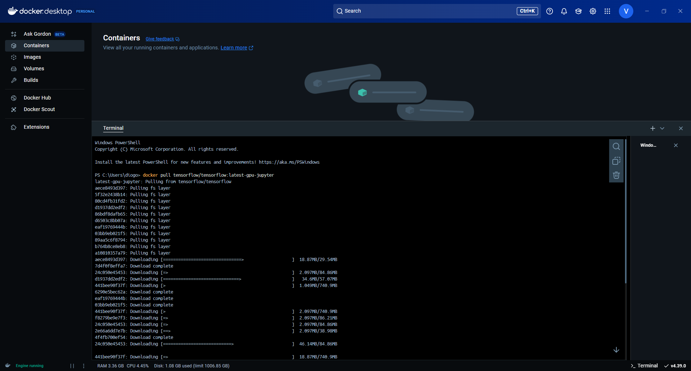

# Análise de Séries Temporais e Previsão

Realizado por Grupo 7:

- Diogo Freitas
- João Francisco Botas
- Miguel Gonçalves
- Ricardo Galvão

Para a execução deste projeto foi desenvolvida uma forma de executar os notebooks ao alocar recursos e _background jobs_ para a GPU. Desta maneira conseguimos treinar as redes neuronais deste desafio de forma mais eficiente e rápida.

# Executar os Notebooks e Redes Neuronais com GPU

Abaixo estão as instruções para configurar e executar o ambiente corretamente.

## Requisitos

- **Docker** instalado na máquina;
- **VS Code** com a extensão "Remote - Containers";
- **Driver NVIDIA** e **CUDA** instalados, para suporte a GPU -> (**opcional**).

## Passo a Passo

### 1. Abrir o Terminal

### 2. Instalar a Imagem do TensorFlow com Suporte a GPU
Executar o seguinte comando para instalar a imagem do TensorFlow com suporte a GPU e Jupyter Notebook:

```bash
docker pull tensorflow/tensorflow:latest-gpu-jupyter
```

   <div style="text-align: center;">
       
   </div>

### 3. Criar o DevContainer na Root do repositório (ASTP)
Na raiz do desafio 2 (root), configurar um DevContainer para correr dentro do ambiente do Docker.

**NOTA**: Em alternativa aos 3 passos seguintes desta secção, é possível apenas utilizar o `.devcontainer` criado na root deste repositório.

1. Criar um diretório `.devcontainer` na raiz do projeto, se ainda não existir.
2. Ter um Dockerfile com o código seguinte:

```
ARG VARIANT="latest-gpu-jupyter"
FROM tensorflow/tensorflow:${VARIANT}

RUN apt-get update && apt-get install ffmpeg libsm6 libxext6 libcudnn9-cuda-12  -y 

# [Optional] Uncomment if you want to install an additional version
#  of node using nvm
# ARG EXTRA_NODE_VERSION=18
# RUN su node -c "source /usr/local/share/nvm/nvm.sh \
#    && nvm install ${EXTRA_NODE_VERSION}"
```


3. Dentro deste diretório, criar um ficheiro `devcontainer.json` com o seguinte conteúdo:

```jsonc
{
	// For quick reference: https://containers.dev/implementors/json_reference/
	"name": "Tensorflow GPU Jupyter",
	"build": { "dockerfile": "Dockerfile" },
	//"build": {
	//	"context": "..",
	//	"dockerfile": "Dockerfile"
	//},

	// 1. Use 'forwardPorts' to make a list of ports inside the container available locally.
	// "forwardPorts": []

	// 2. Use 'mounts' to make a list of local directories available inside the container. More info: https://code.visualstudio.com/remote/advancedcontainers/add-local-file-mount
	// "mounts": [],

	// 3. Use 'runArgs' to pass arguments to the container. 
	// run the container with all GPUs
	"runArgs": [
		"--gpus",
		"all"
	],

	// 4. Features to add to the Dev Container. More info: https://containers.dev/implementors/features.
	"features": {
		// ZSH without OMZ
		"ghcr.io/devcontainers/features/common-utils:2": {
			"installZsh": "true",
			"configureZshAsDefaultShell": "true",
			"installOhMyZsh": "false",
			"installOhMyZshConfig": "false",
			"username": "vscode",
			"userUid": "1000",
			"userGid": "1000"
			// "upgradePackages": "true"
		},

		// Python with uv, Ruff, Mypy, MonkeyType and Bandit, installed using pipx
		"ghcr.io/devcontainers/features/python:1": {},
		// git
		"ghcr.io/devcontainers/features/git:1": {
			"version": "os-provided",
			"ppa": "false"
		}
	},
	
	// 5. Configure tool-specific properties.
	"customizations": {
		// Configure properties specific to VS Code.
		"vscode": {
			// Set *default* container specific settings.json values on container create.
			"settings": {
				"python.defaultInterpreterPath": "/usr/bin/python"
			},
			// installs useful extensions
			"extensions": [
				"ms-python.python",
				"ms-python.debugpy",
				"ms-python.vscode-pylance",
				"ms-python.isort",
				"ms-toolsai.jupyter",
				"ms-toolsai.jupyter-keymap",
				"ms-toolsai.vscode-jupyter-cell-tags",
				"ms-toolsai.jupyter-renderers",
				"ms-toolsai.vscode-jupyter-slideshow",
				"ms-toolsai.tensorboard"
			]
		}
	},
	
	// 6. Set `remoteUser` to `root` to connect as root instead. More info: https://aka.ms/vscode-remote/containers/non-root.
	"remoteUser": "vscode",

	// the following commands are related to container lifecylce. More info: https://containers.dev/implementors/json_reference/#lifecycle-scripts
	
	// 7. Use 'initializeCommand' to run commands ON THE HOST before container is created or started.
	// "initializeCommand": "",

	// 8. Use 'onCreateCommand' to run commands INSIDE THE CONTAINER after it started for the first time.
	// for the nvida containers, sh points to sh-wrap. We want it to point to dash
	// https://wiki.debian.org/Shell
	"onCreateCommand": "pip install -r requirements.txt"
	
	// 9. Use 'updateContentCommand' to run commands if the root filetree have any changes, during container creation.
	// "updateContentCommand": "",

	// 10. Use 'postCreateCommand' to run commands after the container is created.
	// "postCreateCommand": "pip3 install --user -r requirements.txt",

	// 11. Use 'postStartCommand' to run a command each time the container starts successfully.
	// "postStartCommand": "",
	
	// 12. Use 'postAttachCommand' to run a command each time a tool attaches to the container successfully. 
	// "postAttachCommand": "",

}
```

### 4. Abrir o VS Code e Fazer "Rebuild and Reopen in Container"

1. No **VS Code**, abrir a pasta raiz do projeto.
2. Pressionar `Ctrl+Shift+P` e selecionar **Reopen in Container**.
3. Aguardar a reconstrução do container (`Rebuild` se necessário).

Após estas fases, o ambiente estará pronto para a execução dos notebooks com suporte a GPU.

## Executar os Notebooks

Com o ambiente configurado, abrir o terminal dentro do DevContainer e iniciar o Jupyter Notebook.

Agora é possível executar os notebooks e aproveitar a aceleração pela GPU! :)

---

Se existirem problemas, pode ser necessário verificar se os drivers da NVIDIA e o CUDA estão instalados e configurados corretamente no sistema.

